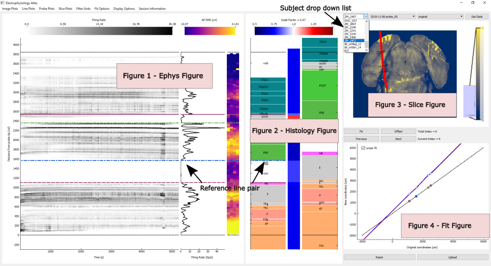

# Ephys Atlas GUI

GUI to allow user to align electrophysiology data with histology data

## Setup

Install the iblenv environment using the following instructions:
https://github.com/int-brain-lab/iblenv

If you have previously installed the environment, an additional package that is required is SimpleITK, this can be
installed in the environment using,

```
conda activate iblenv
pip install SimpleITK
```

To launch the GUI run the following commands from a terminal
```
conda activate iblenv
python <path to ephys_atlas_gui.py>
```
e.g
```
python int-brain-lab\iblapps\atlaselectrophysiology\ephys_atlas_gui.py
```

## Usage
### Getting Data
Upon launching, the GUI automatically finds subjects that have probe tracks traced. To select a subject
click on the first drop down menu in the right hand panel of the GUI. A list of sessions for the chosen subject and
previous alignments associated with each session will then be loaded in the second and third drop down menus respectively.
If this is the first time an alignment is being conducted for a session the only alignment option will be 'original'. If,
however, the session has been previously aligned, it is possible to initiate the GUI from the previous alignment. Once the 
drop down options have been chosen, click on the Get Data button to download the data. The gui will automatically
download all data necessary 

In the case that some data is not available on FlatIron, plots associated with this data will not be displayed and a
warning message is printed in the terminal.

If you find that the histology image is not being found, please refer to the [histology image troubleshooting](#Histology Image Troubleshooting) section


### Layout
The GUI comprises four main figure areas. 



####Figure 1 - Ephys Figure
The first figure contains three panels which display electrophysiology data in the form of:

* Image Plots (2D representation of data in image or scatter plots)
* Line Plots (1D representation of data in a line plot)
* Probe Plots (2D representation of data as a heatmap overlaid on the Neuropixel 3B geometry)
 
 Different types of data can be viewed in each of the panels and the available options can be seen by clicking on the **Image Plots**, 
 **Line Plots** and **Probe Plots** menu bar. The display in each panel can be changed by clicking through the options in each menu bar or 
 by using the shortcut Alt+ 1, Alt + 2, Alt + 3, for the image, line and probe plots respectively.
 
 The order of the panels can also be rearranged by changing the view (under the **Display Options** menu bar) or by
 pressing, Shift + 1, Shift + 2 or Shift + 3.
 
 ####Figure 2 - Histology  Figure
 The second figure displays the brain regions through which the traced probe track passes (the trajectory). It is split into 
 three panels, which display, from left to right,
 * Scaled brain regions
 * Scale factor applied to brain regions - represented as heatmap
 * Original (unscaled) brain regions - for reference

The black dotted lines on the left and right panels indicated the location along the trajectory of the first and last
electrode. The labels overlaid on the brain regions can be toggled on and off using Shift + L

The actual scale factor value is displayed in the title of the colorbar (top of figure) when hovering over a region on
the scale factor plot.
 
 ####Figure 3 - Slice Figure
The third figure displays a tilted slice through the brain. The tilt of the slice displayed is determined by the line
of best fit through the traced points. Overlaid on the slice is a black line linking the traced points (the trajectory) 
and the location of the electrodes on the Neuropixel probe along this trajectory (red points). When reference lines are added
to the Ephys and Histology figures, they are displayed as black dotted lines perpendicular to the local trajectory.
The collection of lines and points overlaid on the slice figure can be toggled on and off using Shift + C.

There are three options for the tilted slice displayed (changed using Alt+ 4):
* Slice taken from red channel of histology image
* Slice taken from allen brain atlas
* Slice taken from allen brain atlas annotation

The intensity of the slice images can be changed using the intensity scale bar located on the right hand side of the figure.

####Figure 4 - Fit Figure
The fourth figure provides a 2D representation of the scaling applied along the depth of the trajectory. Coordinates
are relative to the location of the most ventral electrode. Three lines are displayed in this figure
* Reference line (black dotted line) - reference for when no fit/scaling is applied
* Fit line (blue solid line) - piecewise fit along depth of trajectory
* Linear fit line (red dotted line) - linear fit along depth of trajectory (only present when two or more reference lines
are implemented) 

###Alignment
Reference line pairs are used to align features on the Ephys and Histology figures. A pair can be added to the GUI by
double clicking at any point on either the Ephys or Histology figure and the line on each figure moves independently. 
Once the two lines of a reference pair line have been moved to the feature/landmark that needs to be aligned, the fit
can be applied by pressing the **Fit** button or by pressing Enter key.

Different types of fit are applied depending on the number of reference lines implemented.

#### One reference line
A fit applied with a single reference line pair will result in an offset. 

Two other methods (independent of reference lines) for applying an offset are available
* Drag the black dotted lines (indicate location of first and last electrode) on the left panel of the histology figure
to the desired position and press the **Offset** button or the 'o' key
* Pressing Shift + Up arrow or Shift + Down arrow will apply a +- 50 um offset

#### Two reference lines
A fit applied with two reference line pairs will result in an offset and scaling of regions between the two reference line pairs.
The remaining regions, located beyond the reference lines, will be offset, however, will remain unscaled.

#### Three or more reference lines
A fit applied with three or more reference line pairs will result in an offset and piecewise scaling of regions between each
of the reference lines. By default the remaining regions will be scaled according to a linear fit through all the reference lines
(red dotted line in fit figure). If instead, one wants to keep the regions beyond the reference lines unscaled, the default can be
turned off by un-ticking the linear fit checkbox located in the fit figure.

When a fit is applied the location of the electrodes on the slice figure will update.

A reference line can be deleted by hovering over the line and pressing the del key. N.B. Any fits anchored on a reference line will
be lost once the line is deleted. The reference lines can be hidden/ redisplayed using Shift + H. 

### Uploading data
Once the alignment is complete, the new locations of the electrode locations can be uploaded to Alyx by pressing the **Upload**
button or Shift + U. If a previous alignment has already been uploaded for this session the user will be warned that the channels object in Alyx
will be overwritten. The channels object for all previous alignments can be recovered, so overwriting is not a problem.

###Additional Features
#### Session Notes
If any notes associated with a session have been uploaded to Alyx, these can be displayed as a popup by clicking on
**Session Information** on the menu bar and selecting **Session Notes**

#### Region Information
Information about brain regions that has been entered in Alyx can be displayed by hovering over a brain region in the
histology figure and pressing Shift + I. This will bring up a popup with the brain regions organised according to the allen
atlas structure tree. 

#### Cluster Popup
When displaying the cluster plots on the 2D image plats, the cluster autocorrelogram and template waveform can be viewed in
a popup by clicking on a scatter point. It is possible to display many popups for different clusters. To collectively
minimise/ show the cluster popup windows press Alt + M (make sure your cursor is located on the main gui window, not a popup window).
To close the cluster popup windows press Alt + X

#### Filter Units
By default, the plots in the Ephys figure are shown for all units that have been classified as 'Good' and 'Mua' following
spike sorting. The **Filter Unit** option in the menu bar can be used to restrict the type of unit displayed.

#### Previous Fits
A total of 10 previous fits are stored in memory. One can move to previous fits by using the **Previous** and **Next** buttons or by using
the Left and Right arrow keys. 

#### Reset
To reset the GUI to the original state, i.e. no alignments, press the **Reset** button or Shift + R.

#### Rescaling
It is possible to zoom in on some plots in the Ephys and Histology figures. To reset the axis press Shift + A.

##Histology Image Troubleshooting
The naming convention used for subjects in the histology folder on FlatIron (http://ibl.flatironinstitute.org/histology/) 
is not always consistent with the subject names stored in Alyx. While the code attempts to account for differences in
capitalisation or underscores, sometimes the naming in the histology is just too quirky. In these cases, it will be
necessary to manually download the histology image required for the GUI.

The image file required is located in the *downsampledStacks_25/sample2ARA/* folder of the subject on FlatIron, and has
the extension **.....RD.tif** file. This file should be downloaded and placed in a folder called *histology* in the 
associated subject folder on your local computer

e.g. Download **STD_dsIBL_WITTEN_13_200109_121739_25_25_RD.tif** from
http://ibl.flatironinstitute.org/histology/wittenlab/IBL_Witten_13/downsampledStacks_25/sample2ARA/

and place this file in

C:\Users\Mayo\Downloads\FlatIron\wittenlab\Subjects\ibl_witten_13\histology